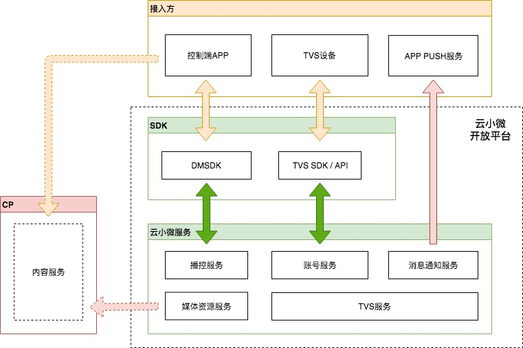
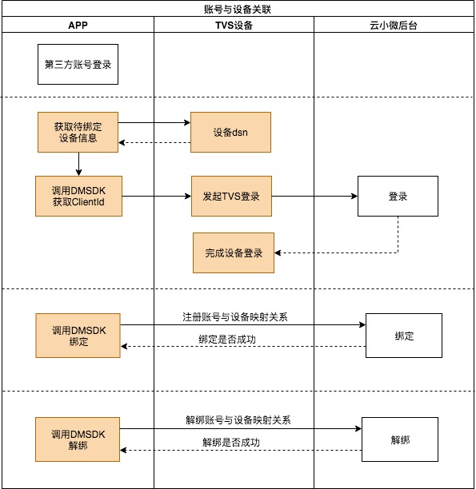
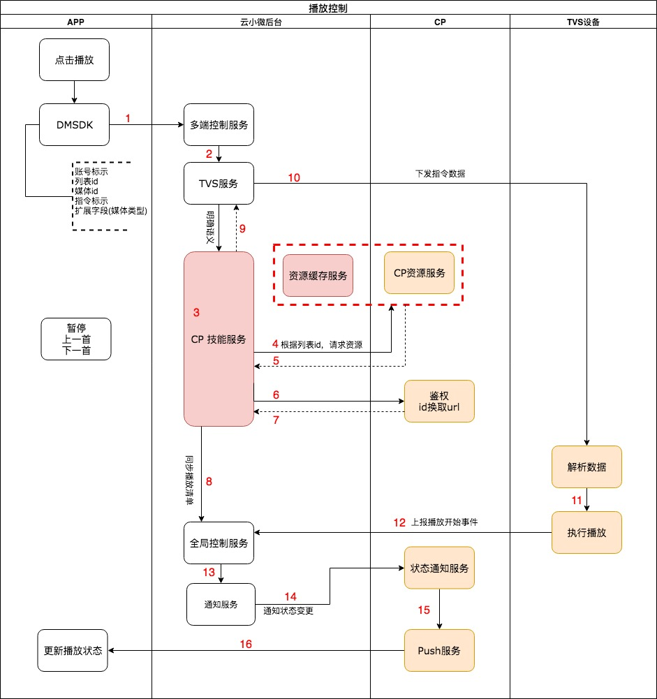
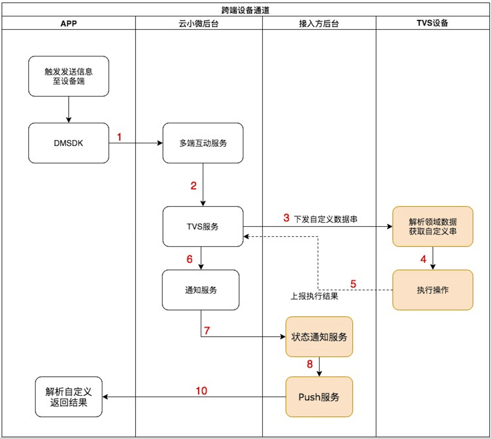

#TVS设备-APP播放控制接入说明

[TOC]

## 版本

| 日期      | 版本 | 修改人     | 备注 |
| --------- | ---- | ---------- | ---- |
| 2019/5/10 | 1.0  | zacardfang | 初稿 |
|           |      |            |      |
|           |      |            |      |


## 方案介绍

**控制端**：手机APP

**被控设备**：接入云小微设备开放平台的设备

**媒体资源：**当前只支持在线媒体资源

该系统描述了通过控制端通过指令控制被控设备执行**播放、暂停、上一首、下一首**等操作；提供**被控设备媒体播放状态**的上报通知的通道，和**自定义消息**传递通道。


**系统结构**:




## 接入流程

###一、响应端—TVS设备

如已完成设备接入，可忽略设备端接入。

设备接入TVS参考下方文档：

https://dingdang.qq.com/doc.html?dir=/doc/tvs/doc/tvs/cloud/tvs_api.html

[https://github.com/TencentDingdang/tvs-tools/blob/master/doc/AVS%E5%85%BC%E5%AE%B9API%E6%8E%A5%E5%8F%A3%E6%96%87%E6%A1%A3.md](https://github.com/TencentDingdang/tvs-tools/blob/master/doc/AVS兼容API接口文档.md)

**设备端还需要实现TVS后台的Push消息指令和确认的上报：**

参考[多端控制协议](多端控制接入协议.md)中1.3章节，`TVS API (音箱侧)协议`部分。

注：播控强依赖设备端媒体状体的上报，必须按照上述连接文档和多端控制协议实现事件上报。

###二、控制端—APP

手机端APP通过接入DMSDK(version>=2.1.0)实现播控能力，目前支持android和iOS；

DMSDK接入参考下方文档（多端互动部分）:

https://github.com/TencentDingdang/dmsdk

APP端必须完成以下步骤：

####1、APP账号与被控设备绑定

APP账号与被控设备绑定是播控功能的必要条件。

支持使用云小微账号和第三方账号。

账号相关参考文档：

https://github.com/TencentDingdang/dmsdk/tree/master/doc

如果是使用云小微账号，接入dmsdk账号模块后直接调用core模块的设备绑定接口；

如果是使用第三方账号，建议参考一下流程。设备绑定接口同上(请阅读文档中关于第三方账号的说明)；



说明：
第三方账号登录，需要生成clientId给到设备，设备完成TVS登录；

然后APP完成绑定步骤。

####2、实现播控指令控制流程



#####2.1 播控指令下发至设备端

如上图中1—11步描述此过程链路。

手机端只需调用DMSDK中TVSDeviceControl模块代码，发出播放/暂停等指令消息即可。具体参照：

**iOS—TVSDeviceControl**

```
-(NSString *)controlDeviceWithNamespace:(NSString *)nameSpace name:(NSString *)name payload:(NSDictionary *)palyload handler:(TVSTSKMCallback)handler;
```

**android—TVSDeviceControl**

```
public void controlDevice(java.lang.String namespace, java.lang.String name, java.lang.String payload, TVSCallback1<java.lang.String> callback)
```

可支持的控制操作和参数请查阅参考[多端控制协议](多端控制接入协议.md)中1.1章节，`手机端控制音箱协议`部分

#####2.2 设备端播放状态变更

如上图中12—16步描述此过程链路。

**a.App端必须按照[多端控制协议](多端控制接入协议.md)中1.1章节，`手机端控制音箱协议-多端控制`部分，在必要时机调用注册和取消注册接口。注册接口表示当前接受设备端状态变更通知，取消注册表示不在接受设备端状态变更通知。**

建议：

App切换到前台时，调用注册；当注册有效期截止前需要重新注册；

App切换到后台时，取消注册；

**b.此部分依赖接入流程中[响应端—TVS设备](#一、响应端—TVS设备)部分，TVS设备必须上报媒体状态。**

**c.另:接入方需提供**状态通知服务**的notify_url，并实现相关数据服务用于接受设备的状态变更通知，参照

[多端控制协议](多端控制接入协议.md)中给`第三方后台进行异步PUSH协义`部分。**

**d.接入方需实现自己的**状态通知服务**到App端的push通路。（android与iOS的app一般都有Push功能）**


###三、 媒体资源

播控系统支持以下2种形式的媒体资源：

**a.云小微H5资源**

访问云小微H5资源，必须接入云小微的账号。

App端可以通过DMSDK中的webview功能打开资源H5，对应的js交互事件参考以下文档：

[音乐点播接入H5.pdf](音乐点播接入H5.pdf)

调用者在对应的js回调中按照[实现播控指令控制流程](#2、实现播控指令控制流程)说明调用需要的接口。

如：点击H5中具体的一首歌，会触发js中选中媒体的回调，调用者可按照协议下发开始播放的指令，让设备端播放选择的歌曲。

**b.合作的第三方资源提供商资源**

如需播放指定cp的媒体资源，需联系云小微。


###四、App与设备的自定义消息

此部分作为播控系统的扩展功能，支持接入方App与设备端传输自定义消息，用于支持一些定制需求。



接入方案同[实现播控指令控制流程](#2、实现播控指令控制流程)，具体的协议参考[多端控制协议](多端控制接入协议.md)中1.1章节，`手机端控制音箱协议-消息传递`部分。

